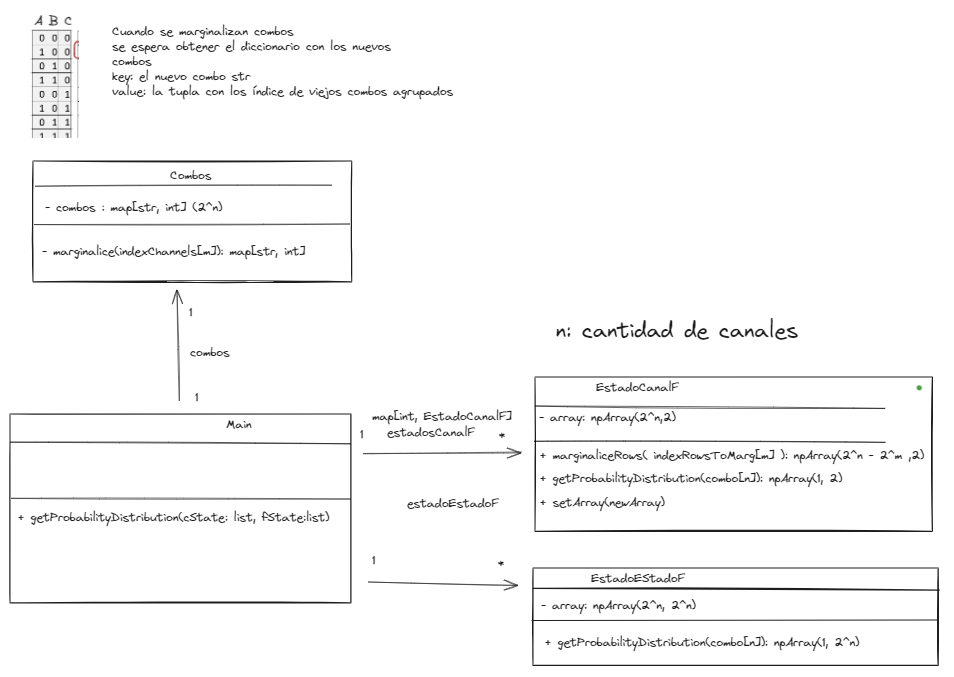
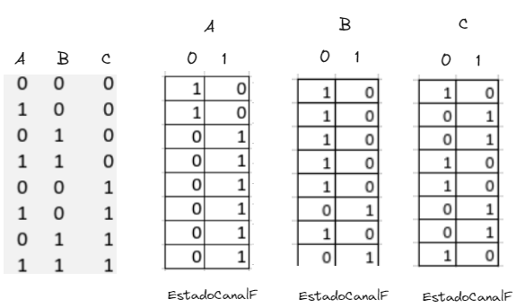
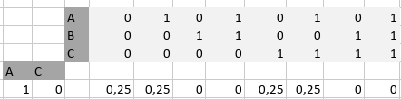
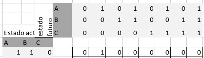
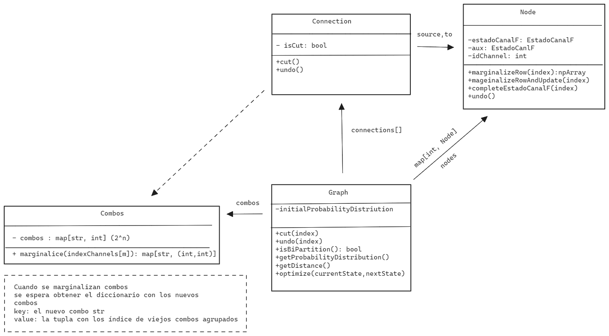

# Diseño

# Instalación
```bash
git clone https://github.com/luisEmilioG1/proy-analisis

cd proy-analisis

pip install -r requirements.txt
```
# Entrega 1
Se permite calcular la distribución de probabilidades de cualquier subsistema de estados no vacíos `(current_state | next_state = xxxx)` partiendo de tablas `EstadoCanalF`


### test 1
`(ABC | AC=10 )` 

### test 2
`(ABC | ABC=110)`


## Ejecución
```bash
python3 -m unittest entrega1.py
```

# Entrega 2
## Diseño


## Características
* Cálculo de distribuciones de probabilidades con vacío tanto en presente como en futuro
* Crear un grafo que representa un sistema dado por (f_state|c_state=XXXX)
* Eliminación y restablecimiento de cualquier conección del grafo  
* Verificar distancia entre distribuciones de probabilidad

## Ejecución
```bash
python3 entrega2.py
```